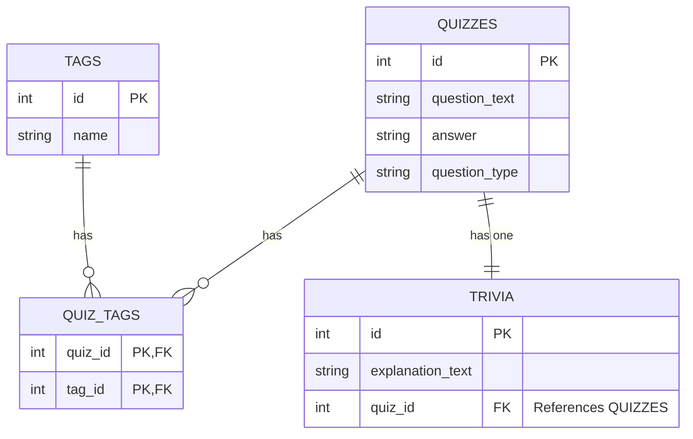

```mermaid
erDiagram
QUIZZES ||--o{ QUIZ_TAGS : "has"
TAGS ||--o{ QUIZ_TAGS : "has"
QUIZZES ||--|| TRIVIA : "has one"

    QUIZZES {
        int id PK
        string question_text
        string answer
        string question_type
    }

    TRIVIA {
        int id PK
        string explanation_text
        int quiz_id FK "References QUIZZES"
    }

    TAGS {
        int id PK
        string name
    }

    QUIZ_TAGS {
        int quiz_id PK,FK
        int tag_id PK,FK
    }
```

- `QUIZZES` と `TRIVIA` は `has one` の関係です。
- `QUIZZES` と `TAGS` は、中間テーブル `QUIZ_TAGS` を介して多対多の関係になっています。
- 各テーブルのカラム名とデータ型、主キー (`PK`)、外部キー (`FK`) も定義されています。
